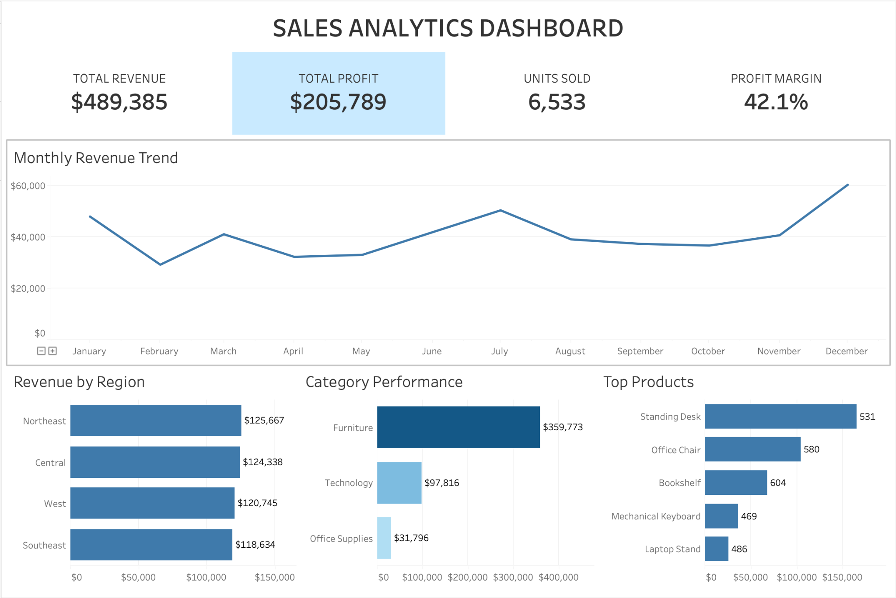

# Sales Analytics Dashboard

A portfolio project that demonstrates an end-to-end sales analytics workflow using **Microsoft Excel, SQL, and Tableau**.

## Dashboard Preview



## Project Goal
Analyze retail sales data to identify revenue trends, regional performance, product demand, and profitability. The final deliverable is an interactive Tableau dashboard supported by cleaned Excel data and SQL analysis.

## Tools
- Microsoft Excel — data cleaning, validation, and summary checks
- SQL — KPI calculations, aggregation, and business analysis
- Tableau — interactive dashboard and visual storytelling

## Dataset
The included dataset contains 1,000 fictional retail transactions from 2025 with:
- Order date and ID
- Region
- Product and category
- Units sold
- Unit price and discount
- Revenue, cost, and profit

## Analysis Questions
1. Which regions generate the most revenue and profit?
2. Which products and categories perform best?
3. How does revenue change month to month?
4. Which products have the strongest customer demand?
5. What is the overall profit margin?

## Repository Structure
```text
sales-analytics-dashboard/
├── README.md
├── data/
│   ├── raw_sales_data.csv
│   └── cleaned_sales_data.xlsx
├── sql/
│   └── sales_analysis.sql
├── tableau/
│   └── TABLEAU_INSTRUCTIONS.md
└── images/
    └── ADD_DASHBOARD_SCREENSHOT_HERE.txt
```

## Excel Cleaning
The Excel workbook contains the cleaned dataset and an `Excel Summary` sheet. Checks include:
- Consistent column names
- Standardized dates and categories
- Revenue, cost, and profit validation
- KPI summaries for revenue, profit, units sold, and profit margin

## SQL Analysis
The SQL file includes queries for:
- Overall KPIs
- Revenue and profit by region
- Product performance
- Category performance
- Monthly sales trends
- Top products by revenue

## Tableau Dashboard
Build a dashboard containing:
- KPI cards: Total Revenue, Total Profit, Units Sold, Profit Margin
- Monthly Revenue Trend — line chart
- Revenue by Region — bar chart
- Revenue/Profit by Category — bar chart
- Top Products — bar chart
- Filters for Region, Category, and Month

After building it, export a screenshot to `images/dashboard_preview.png` and add your Tableau Public link here.

**Tableau Public:** Add link after publishing.

## Resume Description
- Built an interactive Tableau dashboard analyzing revenue trends and product performance.
- Wrote SQL queries to extract and structure data for analysis.
- Cleaned and transformed data using Excel to improve reporting accuracy.
- Visualized KPIs including revenue growth, regional performance, and product demand.

## Note
This project uses a synthetic dataset created for portfolio and learning purposes.
